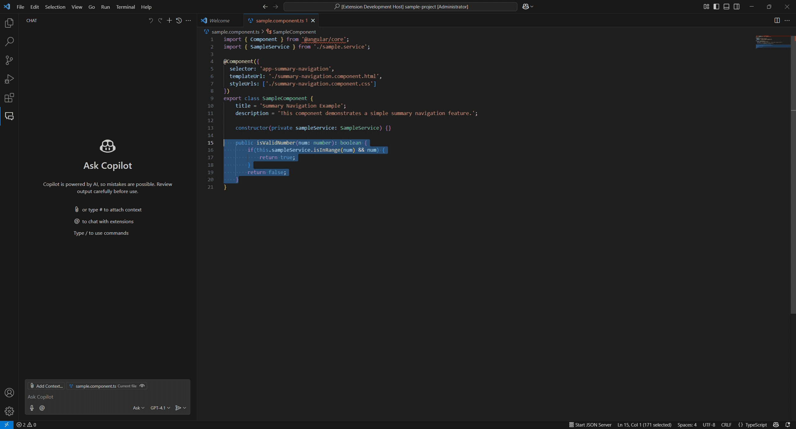

# Smart Code Reviewer
A VS Code extension that leverages GitHub Copilot to provide code reviews for Angular and Jest

> **Note:** This extension currently supports only **Angular TypeScript** projects and those using the **Jest** unit-test framework.

---

## Prerequisites

- **Visual Studio Code**  
- **GitHub Copilot** extension installed and enabled in VS Code

---

## Features

- **Two review modes**  
  - **Review Angular Code** – uses `angular_code_review_guidelines.md`  
  - **Review Jest Unit Tests** – uses `jest_unit_test_code_review_guidelines.md`  
- **Custom guidelines**
  Point to your own `CODE_REVIEW_GUIDELINES.md` via a workspace setting; otherwise falls back to the built-in defaults.
- **Model selection**
  Choose which Copilot model to use via the `codeReviewer.model` setting (defaults to `GPT-4o`).
- **Context-menu integration**
  Right-click inside the editor when you have a selection to choose your review mode.
- **Command-palette support**  
  Run either review command directly from the palette.

---

## Contact & Feedback

- **GitHub**: [@mr-desilva](https://github.com/mr-desilva)  
- **Issues & Requests**: [Submit here](https://github.com/mr-desilva/smart-code-reviewer/issues)
